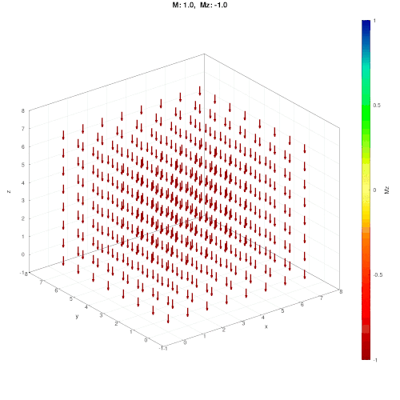

# Heisenberg 3D model

In the following gif, we present an animation of the Metropolis algorithm in action. Every snapshot shows the evolution after $N_S$ = 100 steps at temperature $T = 0.5$ with an external magnetic field of $h = [0,0,1], adding up to a total of $N_{max}$ = 10000 steps. 



# Table of contents

 1. Introduction
 2. Structure of the code
 4. Algorithms
    - Metropolis
    - Adaptive Metropolis
    - Wolff Algorithm
 5. Results
 6. Contributions
 7. Installation
 8. Libraries

# Introduction

This repository contains the code to simulate the 3D Heisenberg Model using
different algorithms. The 3D Heisenberg Model is a lattice model that
is used to simulate the behavior of magnetic materials under various
conditions. The three algorithms implemented for the simulation are the Wolff
algorithm, the standard Metropolis algorithm and an adaptive version
of the Metropolis algorithm.

In this README file we give instructions for the installation of the
required libraries, provide an overview over the code, describe the
core difference between the three algorithms implemented and give a 
brief overview over the results that can be obtained using our code. 
Finally, we list our contributions.


# Structure of the code 

#### code

Our implementation can be found in the folder 'code'.
The different folders contain the following:


- Data / : for evaluating, storing, loading data
    - DataHandler.h++: store and load data
    - Plot.h++: includes plotting functions for the lattice
- Measure: contains various measure functions
    - Timer.h++: defines a simple and easy to use stopwatch
    - Observables.h++: defines functions to measure the Lattice
        1. get::energy: calculates energy of the current lattice configuration
        2. get::magnetisation: calculates magnetization of the current lattice configuration
    - LoadingBar.h++: implements a Loading bar to track progressof simulations
- Metropolis:
    - metropolis.h++: implements the metroplis algorithms
    - energy_diff.h++: calculates the energy difference between initial and proposed configuration
- Wolff / : wolff algorithm
    - wolff.h++: defines the Wolff algorithm
- Base.h++: types and includes of most important files
- Eigen.h++: includes 'Eigen' for linear algebra operations
- Heisenberg.h++: wraps up all headers in one centralized header
- Lattice.h++: defines 3D lattice class of the Heisenberg model 
- RNG.h++: standardized random number generator used in the whole repository
- Spin.h++: defines our spins and the member functions
- Array.h++: includes various function for Array aka. std::vector

#### buildscripts

contains various build scripts

#### docs

contains plots, documents and launch scripts for the euler cluster

#### libraries 

contains all libraries

#### Programs

contains various programs for the Heisenberg3D modell

#### .vscode

contains files for working in VS-Code

## Lattice3D

Lattice3D is a 3D-Array container class capable of handling 
different lattice sizes and periodic and open boundary 
conditions. For optimization purposes, the individual lattice lengths should be 
powers of 2. If you would like to change that, add the flag or
definition: `-DWITHOUT_POW2`.

```cpp
// define the dimensions of the lattice
uint Lx = 4; uint Ly = 4; uint Lz = 32;
// initialize the lattice
Lattice3D<Spin> lattice(Lx ,Ly ,Lz);
// set open (Dirichlet) or periodic (Periodic) boundary, default is Periodic
lattice.set_boundary_conditions(BC::Dirichlet);
// set the dirichlet boundary to {0,0,1}, default is {0,0,0}
lattice.set_zero_element(Spin{0,0,1});
// get a element at x,y,z
Spin s = lattice(x,y,z);
// set element at x,y,z
lattice(x,y,z) = s;
```

The Lattice3D class also includes a specialized boolean version.

```cpp
// initialize the boolean lattice
Lattice3D<bool> latticeBool(4,4,4);
// get an element at (x,y,z)
bool value = latticeBoll.get(x,y,z); 
// set element at (x,y,z)
latticeBoll.set(x,y,z,value);
```

In the follwoing animaion, we present a simulation using the Metropolis algorithm at $T = 0.1$ with an external magnetic field of $h = [0,0,0.01]$, lattice sizes {4,4,16}, and open boundary conditions with a spin zero(`{0,0,0}`) at the boundary. Every spapshot represents 10000 adaptive steps, adding up to 1000000 steps in total.


# Algorithms

## Metropolis

The Metropolis algorithm explores the phase space of the system by proposing
spin flips, based on a specified trial move, and accepts them based on the
energy difference between the two configurations. We implemented three
different trial moves: the spin flip, the small step and the random step, which
are member functions of the spin class. The implementation allows applying an 
external magnetic field as well as a magnetic anisotropy. More information
about the algorithm can be found [here](https://www.aliquote.org/pub/metropolis-et-al-1953.pdf).

## Adaptive Metropolis

The adaptive Metropolis is an extension of the standard Metropolis algorithm,
that is based on a different trial move, with an adaptive elememt. This 
enhances the sampling efficieny and keeps the acceptance rate close to
fifty percent. As for the standard Metropolis, the implementation allows applying an 
external magnetic field as well as a magnetic anisotropy. A detailed description can be found 
[here](https://iopscience.iop.org/article/10.1088/1361-648X/aaf852/meta).

## Wolff

The Wolff algorithm is a cluster update algorithm, that flips entire cluster
contrary to the Metropolis algorithm, which flips individual spins. The 
cluster is build succesively from a randomly chosen site and flipped at
the end of each step. This approach accelerates the exploration of the 
phase space, especially near critical points, making it ideal for studying
phase transitions. More information can be found [here](https://journals.aps.org/prl/abstract/10.1103/PhysRevLett.62.361).

# Results

The code can be used to demonstrate that all algorithms guide an intial spin
configuration towards thermal equilibrium. Notably, for all algorithms,
the value of the observables at equilibirum agree. Simulations show 
a clear phase transition from a magnetized phase at low temperatures to 
a demagnetized phase at high temperatures and the critical exponents 
can be calculated. Additionally, the effect of an external magnetic
field and spatial anisotropies can be observed.

In the following plot, we can observe a phase transition as shown by the order parameter $M$ for $L = 8$. The data was calculated using the Metropolis algorithm.


The time per algorithm step is constant for the Metropolis algorithm, as expected...


... however, for the Monte Carlo steps, we observe an increase over several orders of magnitude. This is known as the critical slowing down of the dynamics:


# Contributions

M.C.W. implemented the observables, J.G. implemented the normal and adaptive Metropolis algorithm, C.T. implemented the Wolff algorithm, D.S. and J.G. implemented the lattice and spin classes. J.G. and C.T. implemented the data calculation. D.S. set up and managed the git-repository. M.C.W., J.G. and C.T. planned the calculations, analysed the data, and created the figures. J.G. and C.T. calculated the linear and non-linear correlation times, determined the critical exponents, and measured the algorithmic performance. D.S. assigned calculations on the EULER cluster. M.C.W. drafted and wrote the report with input from all authors. All authors contributed equally to the theory and final presentations.

# Installation

## Mac-Os

First, you need to install [Homebrew](https://docs.brew.sh/Installation)

install GCC 11 for c++23
```bash
brew install gcc@11 --without-multilib
brew link gcc@11 --force
```
If you have previously installed GCC using Homebrew, you can reinstall it with:
```bash
brew reinstall gcc@11 --without-multilib
```

install cmake
```bash
brew install cmake
```

install eigen
```bash
brew install eigen
```

install openmpi
```bash
brew install openmpi --build-from-source --cc=gcc-11
```

## Linux

install GCC 11 for c++23
```bash
sudo apt-get update
sudo apt-get install g++-11
```
install cmake
```bash
brew install cmake
```

install openmpi on **Debian**
```bash
sudo apt-get install openmpi-bin libopenmpi-dev
```

install openmpi on **other Linux dirtros**
- Download the Open MPI source code from the main Open MPI website.
```bash
# Extract the tarball:
tar xf openmpi-<version>.tar.bz2
cd openmpi-<version>
# Configure and build Open MPI
# Replace <path> with your desired installation directory.
./configure --prefix=<path> [ ...options...]
make [-j N] all
# Install Open MPI:
sudo make install

```

## Windows

Unfortunately, we do not support Windows, but you can install a Windows subsystem for Linux (WSL) and follow the linux installation guide.

[install WSL](https://learn.microsoft.com/en-us/windows/wsl/install)

# Libraries

## Matplot++-Library

Matplot++ (automatically installed through CMake) is used as a plotting library.

[Documentation](https://alandefreitas.github.io/matplotplusplus/)

[Github-Matplot++](https://github.com/alandefreitas/matplotplusplus)

